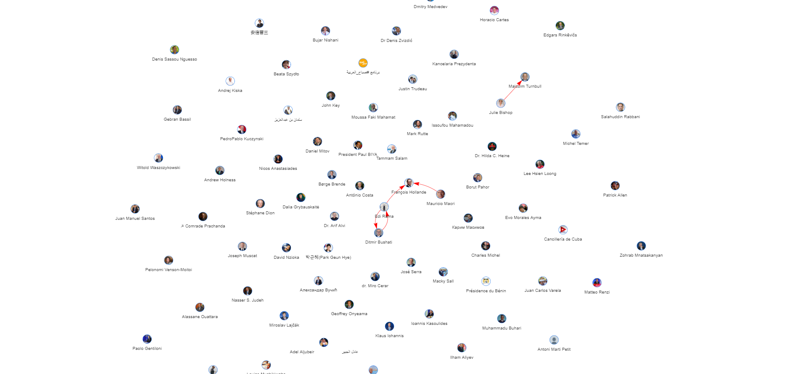

# 外国政要社交媒体言论采集与分析
## 使用twitter爬虫爬取外国政要关系

- 根据以前整理的部分外国政要名单，简单爬取了twitter上名单上的用户
- 爬取用户信息很顺利
- 抓取用户间关注信息碰见问题，若连续往twitter发送请求，会抛出twitter.error.TwitterError异常，此时需要暂停发送请求，等待一段时间后再发送请求
- 可能是vpn不稳定，时间一长，又报连接错误，无法得到关系数据

## 爬取关系数据
直接运行twitter_process目录下的get_relationships.py文件，运行完成后关系数据会保存在result/twitter_edges.json文件中
