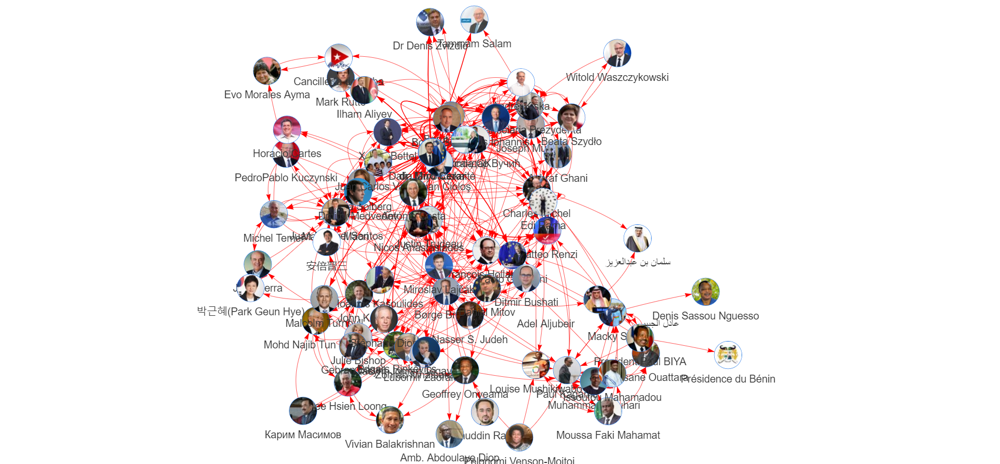
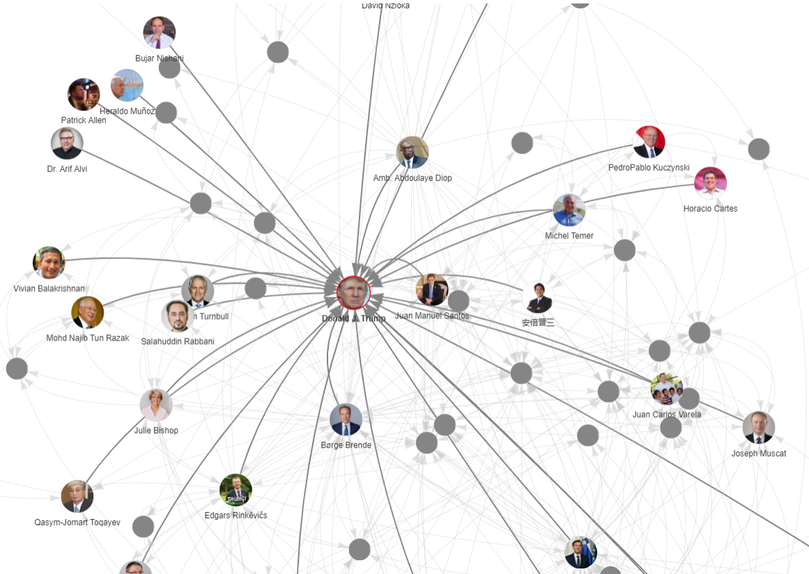

<!--
 * @Descripttion: 
 * @version: 
 * @Author: Da Chuang
 * @Date: 2019-12-10 09:32:42
 * @LastEditors: Da Chuang
 * @LastEditTime: 2019-12-17 20:59:08
 -->

# 外国政要社交媒体言论采集与分析
## 使用twitter爬虫爬取外国政要关系

## 观察Trump的社交网络

## 使用twint爬取关系数据
直接运行twint_process目录下的twint_get_relationships.py文件，运行完成后关系数据会保存在result/twitter_edges.json文件中

## 根据政要名单，爬取与中国相关的tweet
- 根据已整理出的86位名单，已经全部得到与中国相关的tweet，爬取代码在twint_process/twint_get_twitter_china.py中。
- 爬取的数据在data/tweet_related_china目录下，以csv文件存放，每个csv文件为一位政要所有与中国相关的tweet

## TODO
- 目前该名单数据并不完整，待以后整理出完整数据后，重新跑nodes和edges数据
- 待名单数据完整后，执行utils目录下xlsx_util.py文件以得到干净的名单数据。
- 此网络图参数需要调整，无法得出直观有用的信息
- 待以后还需要重点采集twitter中推文内容，分析得出有价值信息

